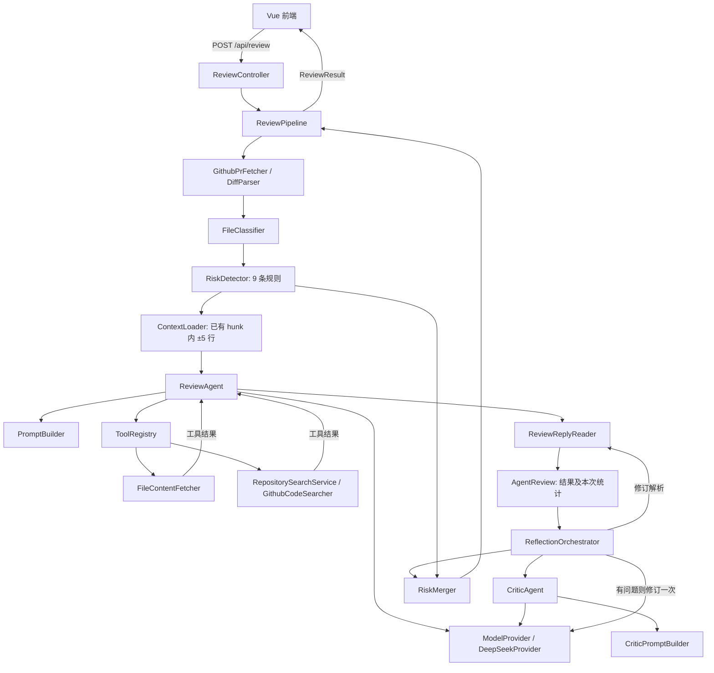

# ReviewPilot 架构

当前是 Vue 3 前端 + Spring Boot 同步单体。完整逐类职责及重构取舍见 [Java 分层审查](java-layering-review.md)，面试图解见 [HTML](interview-eli5.html)。

## 分层职责

| 层 | 组件 | 边界 |
| --- | --- | --- |
| HTTP | Controllers / ApiExceptionHandler | 输入、输出、状态码；无模型文案识别 |
| 应用用例 | ReviewPipeline / PrFilesQuery | 编排和响应组装；无 JSON 解析与 HTTP 调用实现 |
| 审查处理 | 分类、规则、上下文、Agent、复核、Prompt、Reader、RiskMerger | 各自只处理对应策略，不反向调用 Controller |
| 外部适配 | GitHub 抓取/搜索、DeepSeekProvider、OpenAiMessageMapper | HTTP、外部 DTO、协议编码和外部错误 |
| 数据与配置 | model、专用 records、config | 数据契约、值对象、配置与依赖装配 |

没有数据库、DAO、向量库或任务队列。WebClient 调用使用 `.block()`，不是端到端响应式流程。

## 一次请求

1. `PrUrl.parse` 验证链接，`GithubPrFetcher.fetchFiles` 读取文件并委托 `DiffParser` 生成新旧行号。
2. `FileClassifier` 分类为 Controller、Service、Config、SQL、Test、Other。`RiskDetector` 注入 9 个 `RiskRule`，聚合适用规则，单个 scan 失败跳过。
3. `ContextLoader` 从已有 hunks 提取风险附近 ±5 行，合并重叠窗口；不额外查询代码。
4. `RiskFileContextLoader` 可选批量拉取风险文件，每个文件截断至 8k 字符；GitHub 读取/解码由 `FileContentFetcher` 完成。目前这份预取内容用于修订材料，初审仍通过工具自行补全文。
5. `ReviewAgent` 构造会话，模型可以请求读文件或搜索仓库，Java 执行并将结果写回。正常结束、预算强制结束和轮数结束都返回 `AgentReview`，不共享本次统计。
6. `ReviewReplyReader` 清理并解析结果；格式错误修复一次，仍失败提取摘要降级。模型 HTTP 异常继续传播。
7. `ReflectionOrchestrator` 调用 `CriticAgent` 检查遗漏、重复、严重度、幻觉、一致性；必要时按 `CriticPromptBuilder` 提供的反馈提示词修订一次，统一解析后返回结构化结果。
8. `RiskMerger` 按 `(file,line,message)` 精确去重，规则优先；Pipeline 填充模型和耗时元数据后返回。

## 工具和预算

- `fetch_file_content(path)`：读取 PR head ref 上的文件；工具路径未应用批量补充的 8k 截断。
- `search_repo(query)`：GitHub 搜索最多返回 5 个文件路径。`RepositorySearchService` 提供进程内缓存和 25 次/60 秒计数窗口；缓存命中不计数，请求失败不缓存。无 TTL、容量上限或分布式协调。
- Prompt 默认单文件 patch 6,000 字符、用户材料 60,000 字符；Agent 会话预算默认 64,000 字符，80% 时压缩较长工具结果。
- 默认循环 8 轮，工具累计达到 4 次后下轮停止提供工具；单轮多个工具可能超过 4 次。轮数耗尽后的强制输出、格式修复、Critic 和修订还可能增加模型调用。

## 测试和边界

`mvn clean test` 验证算法、适配 HTTP 契约、Spring 装配、流程、格式修复及架构依赖方向。外部服务使用 MockWebServer 或 ModelProvider 测试替身，不证明线上审查准确率。

当前 GitHub 文件列表仅一页，全文按 head 分支名而非固定 SHA，Critic 不读取源码；其他已知能力边界见逐类审查报告。类型拆分不自动解决这些覆盖和效果问题。
