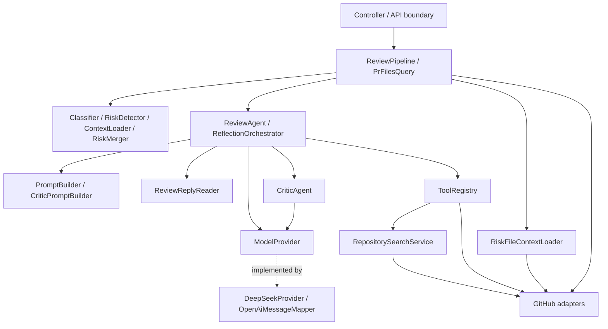

# Java 分层与逐类职责审查

本次检查全部 **69 个生产 Java 文件**（包括类、接口、record、enum），并检查其嵌套 DTO。判定依据是依赖方向和变化原因，而非强制每个功能都有 Controller/Service/DAO。项目没有持久化，不需要为了目录形式增加 DAO。

## 分层结论

原项目已有分层雏形，但应用编排、格式恢复、厂商协议、缓存策略和 HTTP 错误映射存在交叉。已直接重构以下边界，REST 路径和响应字段保持兼容：

| 原职责混淆 | 重构后 |
| --- | --- |
| Pipeline 编排 + JSON 解析/重试 + 风险去重 | ReviewPipeline 编排；ReviewReplyReader 统一恢复；RiskMerger 合并 |
| Agent 循环 + 重复解析 + 单例请求统计 | ReviewAgent 仅保留循环；AgentReview 随调用返回统计 |
| Reflection 同时生成 Prompt、运行 Critic、解析回复 | CriticPromptBuilder + CriticAgent + ReflectionOrchestrator |
| 两个 Controller 重复异常处理，识别厂商文案 | ApiExceptionHandler + AiAuthenticationException |
| 文件查询 Controller 直接使用外部适配器 | PrFilesQuery 应用查询入口 |
| ToolRegistry 混入缓存/限流，PR 抓取器混入仓库搜索 | ToolRegistry → RepositorySearchService → GithubCodeSearcher |
| Message/Tool/ToolCall 混入供应商协议和手写 JSON | 纯数据记录 + OpenAiMessageMapper |
| PrUrl 值对象混入 GitHub REST 路径 | GithubApiPaths 归属 GitHub 适配包 |
| 文件 HTTP 抓取同时做可选批量策略和 Prompt 截断 | FileContentFetcher + RiskFileContextLoader |

## 依赖方向

保留现有按功能分包，逻辑层次不强制等于一级包名。应用层允许依赖当前 GitHub 适配器；这是一套务实的分层单体，不宣称已实现严格六边形架构。底层不反向调用应用或 HTTP 层，编排层不操作 Jackson/WebClient。新增字节码依赖约束测试保护这几个关键边界。

## 逐类结论

“保留”表示职责足够内聚，不表示算法或生产能力没有改进空间。以下列出重构后的职责，明确写“移出/替代”的行对应本次变化。

| 文件 | 当前职责与处理 |
| --- | --- |
| [config/DeepSeekClientConfig.java](../backend/src/main/java/com/reviewpilot/config/DeepSeekClientConfig.java) | 装配模型 HTTP 客户端、超时、请求头与缓冲区。 |
| [config/DeepSeekProperties.java](../backend/src/main/java/com/reviewpilot/config/DeepSeekProperties.java) | 绑定并规范模型配置；提供密钥脱敏表示。 |
| [config/GithubClientConfig.java](../backend/src/main/java/com/reviewpilot/config/GithubClientConfig.java) | 装配 GitHub HTTP 客户端及请求头。 |
| [config/GithubProperties.java](../backend/src/main/java/com/reviewpilot/config/GithubProperties.java) | 绑定并规范 GitHub 配置。 |
| [config/WebCorsConfig.java](../backend/src/main/java/com/reviewpilot/config/WebCorsConfig.java) | 注册 HTTP CORS 策略。 |
| [controller/ApiExceptionHandler.java](../backend/src/main/java/com/reviewpilot/controller/ApiExceptionHandler.java) | 统一异常到 HTTP 状态及 ErrorResponse 的映射；模型认证按类型判断。 |
| [controller/HealthController.java](../backend/src/main/java/com/reviewpilot/controller/HealthController.java) | 提供存活检查响应；无业务编排。 |
| [controller/PrFilesController.java](../backend/src/main/java/com/reviewpilot/controller/PrFilesController.java) | 接收文件查询请求；通过 PrFilesQuery 调用应用层。 |
| [controller/ReviewController.java](../backend/src/main/java/com/reviewpilot/controller/ReviewController.java) | 接收审查请求并调用应用用例；错误映射已抽出。 |
| [model/ErrorResponse.java](../backend/src/main/java/com/reviewpilot/model/ErrorResponse.java) | HTTP 错误契约；保持 error 字段名称。 |
| [model/PrUrl.java](../backend/src/main/java/com/reviewpilot/model/PrUrl.java) | PR 标识、输入解析与不变量校验；API 路径已移出。 |
| [model/ReviewResult.java](../backend/src/main/java/com/reviewpilot/model/ReviewResult.java) | 审查结果及 Meta 数据契约；统一空集合默认值。 |
| [model/RiskItem.java](../backend/src/main/java/com/reviewpilot/model/RiskItem.java) | 一条风险的等级、位置和说明。 |
| [model/RiskLevel.java](../backend/src/main/java/com/reviewpilot/model/RiskLevel.java) | 风险等级枚举。 |
| [model/Suggestion.java](../backend/src/main/java/com/reviewpilot/model/Suggestion.java) | 一条改进建议的位置和说明。 |
| [pipeline/PrFilesQuery.java](../backend/src/main/java/com/reviewpilot/pipeline/PrFilesQuery.java) | 文件查询应用入口：解析 URL 后请求 PR 文件。 |
| [pipeline/ReviewPipeline.java](../backend/src/main/java/com/reviewpilot/pipeline/ReviewPipeline.java) | 应用用例编排、计时及 API 结果组装；不解析 JSON、不重试模型、不实现风险去重。 |
| [ReviewPilotApplication.java](../backend/src/main/java/com/reviewpilot/ReviewPilotApplication.java) | 启动入口；只负责启动 Spring 容器。 |
| [service/ai/AgentResponse.java](../backend/src/main/java/com/reviewpilot/service/ai/AgentResponse.java) | 一次模型调用的文本、工具调用及 token 统计。 |
| [service/ai/AgentReview.java](../backend/src/main/java/com/reviewpilot/service/ai/AgentReview.java) | 一次审查调用的结果和轮次/工具次数；替代单例 last 状态。 |
| [service/ai/AiAuthenticationException.java](../backend/src/main/java/com/reviewpilot/service/ai/AiAuthenticationException.java) | 模型凭证缺失信号；HTTP 层无需识别厂商错误文案。 |
| [service/ai/AiProviderException.java](../backend/src/main/java/com/reviewpilot/service/ai/AiProviderException.java) | 模型适配失败信号。 |
| [service/ai/DeepSeekProvider.java](../backend/src/main/java/com/reviewpilot/service/ai/DeepSeekProvider.java) | 模型 HTTP 适配、响应 DTO 转换与网络错误重试；不审查代码。 |
| [service/ai/JsonReplyCleaner.java](../backend/src/main/java/com/reviewpilot/service/ai/JsonReplyCleaner.java) | 纯文本清洗：围栏去除和 JSON 对象提取。 |
| [service/ai/Message.java](../backend/src/main/java/com/reviewpilot/service/ai/Message.java) | 会话消息记录和构造工厂；已移除协议序列化。 |
| [service/ai/ModelProvider.java](../backend/src/main/java/com/reviewpilot/service/ai/ModelProvider.java) | 模型调用端口；定义 complete/chat 与模型元数据。 |
| [service/ai/OpenAiMessageMapper.java](../backend/src/main/java/com/reviewpilot/service/ai/OpenAiMessageMapper.java) | 模型协议映射及工具参数 JSON 编码；独立于 Agent 数据记录。 |
| [service/ai/RepositorySearchService.java](../backend/src/main/java/com/reviewpilot/service/ai/RepositorySearchService.java) | 搜索缓存及进程内计数窗口策略；成功请求才能进入缓存。 |
| [service/ai/ReviewAgent.java](../backend/src/main/java/com/reviewpilot/service/ai/ReviewAgent.java) | ReAct 状态机、工具轮次与会话预算；结果解析委托 ReviewReplyReader。 |
| [service/ai/ReviewReplyReader.java](../backend/src/main/java/com/reviewpilot/service/ai/ReviewReplyReader.java) | 统一审查 JSON 解码、一次格式修复与摘要降级；回调由调用者提供，不绑定 HTTP。 |
| [service/ai/Tool.java](../backend/src/main/java/com/reviewpilot/service/ai/Tool.java) | 工具描述及参数 schema 数据；已移除协议序列化。 |
| [service/ai/ToolCall.java](../backend/src/main/java/com/reviewpilot/service/ai/ToolCall.java) | 模型提出的工具调用数据；已移除手写 JSON 拼接。 |
| [service/ai/ToolRegistry.java](../backend/src/main/java/com/reviewpilot/service/ai/ToolRegistry.java) | 工具定义、分发、参数读取和工具错误归一化；不拥有搜索缓存或限流状态。 |
| [service/classifier/FileClassifier.java](../backend/src/main/java/com/reviewpilot/service/classifier/FileClassifier.java) | 按路径、注解和文件名启发式分类；不抓代码、不调用模型。 |
| [service/classifier/FileType.java](../backend/src/main/java/com/reviewpilot/service/classifier/FileType.java) | 功能类型枚举。 |
| [service/context/ContextLoader.java](../backend/src/main/java/com/reviewpilot/service/context/ContextLoader.java) | 从已有 diff 提取并合并风险附近窗口；不发网络请求。 |
| [service/context/ContextSlice.java](../backend/src/main/java/com/reviewpilot/service/context/ContextSlice.java) | 供 Prompt 使用的上下文切片数据；展示行文本属于该专用输入契约。 |
| [service/context/RiskFileContextLoader.java](../backend/src/main/java/com/reviewpilot/service/context/RiskFileContextLoader.java) | 可选风险文件批量补充、8k 字符截断与失败跳过；网络读取委托适配器。 |
| [service/critic/CriticAgent.java](../backend/src/main/java/com/reviewpilot/service/critic/CriticAgent.java) | 执行质检、解析质检回复和一次格式重试；提示词由 builder 提供。 |
| [service/critic/CriticResult.java](../backend/src/main/java/com/reviewpilot/service/critic/CriticResult.java) | 质检问题集合及是否需要修订的判断。 |
| [service/critic/ReflectionOrchestrator.java](../backend/src/main/java/com/reviewpilot/service/critic/ReflectionOrchestrator.java) | 决定是否质检/修订并调用模型，返回结构化修订；不拼装提示词、不解析 JSON。 |
| [service/diff/DiffHunk.java](../backend/src/main/java/com/reviewpilot/service/diff/DiffHunk.java) | 一个 diff 区块数据。 |
| [service/diff/DiffLine.java](../backend/src/main/java/com/reviewpilot/service/diff/DiffLine.java) | 一行 diff 的类型、原文与新旧行号。 |
| [service/diff/DiffLineType.java](../backend/src/main/java/com/reviewpilot/service/diff/DiffLineType.java) | 新增、删除、上下文枚举。 |
| [service/diff/DiffParser.java](../backend/src/main/java/com/reviewpilot/service/diff/DiffParser.java) | unified diff 文本解析及新旧行号推进。 |
| [service/diff/FileChange.java](../backend/src/main/java/com/reviewpilot/service/diff/FileChange.java) | 一个变更文件及 patch/hunks 数据。 |
| [service/github/FileContentFetcher.java](../backend/src/main/java/com/reviewpilot/service/github/FileContentFetcher.java) | GitHub head ref 与文件内容读取、Base64 解码；已移出批量策略与 Prompt 截断。 |
| [service/github/GithubApiException.java](../backend/src/main/java/com/reviewpilot/service/github/GithubApiException.java) | GitHub 外部请求失败信号。 |
| [service/github/GithubApiPaths.java](../backend/src/main/java/com/reviewpilot/service/github/GithubApiPaths.java) | GitHub PR REST 路径转换。 |
| [service/github/GithubAuthException.java](../backend/src/main/java/com/reviewpilot/service/github/GithubAuthException.java) | GitHub 鉴权失败状态与消息。 |
| [service/github/GithubCodeSearcher.java](../backend/src/main/java/com/reviewpilot/service/github/GithubCodeSearcher.java) | 仓库搜索 HTTP 适配；返回路径，外部失败抛异常。 |
| [service/github/GithubPrFetcher.java](../backend/src/main/java/com/reviewpilot/service/github/GithubPrFetcher.java) | PR 文件与标题 HTTP 适配；将 patch 交给 DiffParser，已移出仓库搜索。 |
| [service/github/GithubPrFile.java](../backend/src/main/java/com/reviewpilot/service/github/GithubPrFile.java) | GitHub 文件响应的传输 DTO。 |
| [service/github/GithubPrNotFoundException.java](../backend/src/main/java/com/reviewpilot/service/github/GithubPrNotFoundException.java) | PR 不存在或无权访问的失败信号。 |
| [service/prompt/CriticPromptBuilder.java](../backend/src/main/java/com/reviewpilot/service/prompt/CriticPromptBuilder.java) | 质检及修订提示词构造；无模型调用。 |
| [service/prompt/PromptBuilder.java](../backend/src/main/java/com/reviewpilot/service/prompt/PromptBuilder.java) | 审查提示词组织、类型分组及输入材料预算；职责单一，长文本本身不是拆分类的依据。 |
| [service/prompt/PromptTemplate.java](../backend/src/main/java/com/reviewpilot/service/prompt/PromptTemplate.java) | 各功能类型对应的审查关注点模板。 |
| [service/risk/RiskDetector.java](../backend/src/main/java/com/reviewpilot/service/risk/RiskDetector.java) | 聚合适用规则结果，隔离单条扫描异常；分类委托 FileClassifier。 |
| [service/risk/RiskMerger.java](../backend/src/main/java/com/reviewpilot/service/risk/RiskMerger.java) | 按 file/line/message 精确去重并保留规则优先顺序。 |
| [service/risk/RiskRule.java](../backend/src/main/java/com/reviewpilot/service/risk/RiskRule.java) | 规则策略接口，定义适用类型和扫描契约。 |
| [service/risk/rules/BareCatchRule.java](../backend/src/main/java/com/reviewpilot/service/risk/rules/BareCatchRule.java) | 检测新增宽泛 catch 缺少附近日志/重抛的模式。 |
| [service/risk/rules/ExceptionSwallowingRule.java](../backend/src/main/java/com/reviewpilot/service/risk/rules/ExceptionSwallowingRule.java) | 检测 catch 后异常类型转换与 cause 丢失模式。 |
| [service/risk/rules/HardcodedSecretRule.java](../backend/src/main/java/com/reviewpilot/service/risk/rules/HardcodedSecretRule.java) | 检测新增代码/配置中的硬编码敏感值模式。 |
| [service/risk/rules/InsecureRandomRule.java](../backend/src/main/java/com/reviewpilot/service/risk/rules/InsecureRandomRule.java) | 检测适用 Java 代码中的非安全随机数模式。 |
| [service/risk/rules/NestedTransactionRule.java](../backend/src/main/java/com/reviewpilot/service/risk/rules/NestedTransactionRule.java) | 检测事务注解与自调用组合模式。 |
| [service/risk/rules/SqlConcatenationRule.java](../backend/src/main/java/com/reviewpilot/service/risk/rules/SqlConcatenationRule.java) | 检测 SQL 字符串与标识符拼接模式。 |
| [service/risk/rules/SystemOutPrintlnRule.java](../backend/src/main/java/com/reviewpilot/service/risk/rules/SystemOutPrintlnRule.java) | 检测非测试代码中的标准输出调用。 |
| [service/risk/rules/UnreleasedLockRule.java](../backend/src/main/java/com/reviewpilot/service/risk/rules/UnreleasedLockRule.java) | 检测同一 hunk 中缺少匹配释放的加锁模式。 |
| [service/risk/rules/WeakHashRule.java](../backend/src/main/java/com/reviewpilot/service/risk/rules/WeakHashRule.java) | 检测适用代码中的弱哈希模式。 |

嵌套类型：`ReviewRequest` 属于 HTTP 请求；`ReviewResult.Meta` 属于输出诊断；`RefinementResult` 属于一次复核结果；DeepSeek 的 `Ds*` 与 GitHub 的 `PrMetadata/Head/FileContent/SearchResult/SearchItem` 是对应适配器的私有或专用协议 DTO，保留在使用边界。没有为每个协议字段额外制造 Service。

## 验证与可观察变化

- 重构前完整测试通过；新增回归先复现了修订 keyFindings 丢失和工具参数 JSON 编码错误。
- 初审和修订统一解析后保留 keyFindings；工具参数里的引号、换行、反斜杠及嵌套对象由 Jackson 编码。
- Agent 结果与统计绑定到单次调用；并发交错测试验证两次请求不串统计，预算强制结束路径也返回本次统计。
- HTTP 模型鉴权状态通过异常类型映射；普通错误即使包含旧前缀也不会误判为 401。
- 搜索 HTTP 失败与成功的空结果分开：失败转为工具错误，不永久缓存为“无结果”。有 HTTP 503 后恢复成功的回归测试。
- Critic 空白/非对象回复进入格式重试；本环境原行为是被当作无问题，新增测试已复现并验证修复。
- 风险文件批量读取验证只取一次 head、保持 ref、按原 8k 预算截断；关闭补充时不发网络请求。
- 验证命令：在 `backend` 运行 `mvn clean test`，29 个测试类、162 个测试全部通过，0 失败、0 错误、0 跳过。

## 本次保留的能力边界

分页缺失、PR head SHA/fork 一致性、字符预算不是严格 token 上限、搜索缓存无 TTL/容量上限、Critic 未拿源码、提示词标准冲突，以及 YAML 的 agent 层级不匹配仍是独立能力/配置问题。本次没有借分层重构改写这些业务策略。RiskDetector 内部仍可复用 FileClassifier 以支持单独运行；Pipeline 也需要分类用于 Prompt，重复分类可单独优化。

现有同步请求、规则算法、模型接口和前端流程保持原状。编译内的 Java 构造器与返回类型发生内部重构，仓库内调用者与测试均已迁移；未进行真实 GitHub/DeepSeek 联调。
